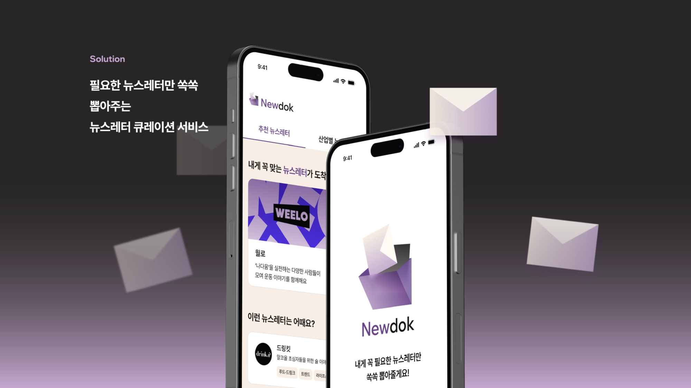
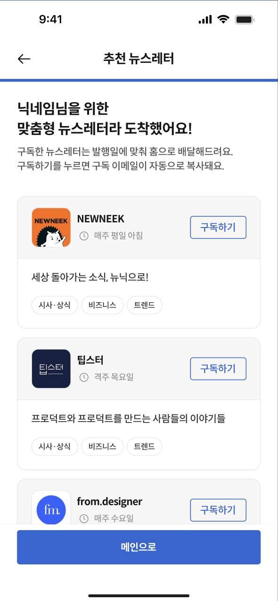
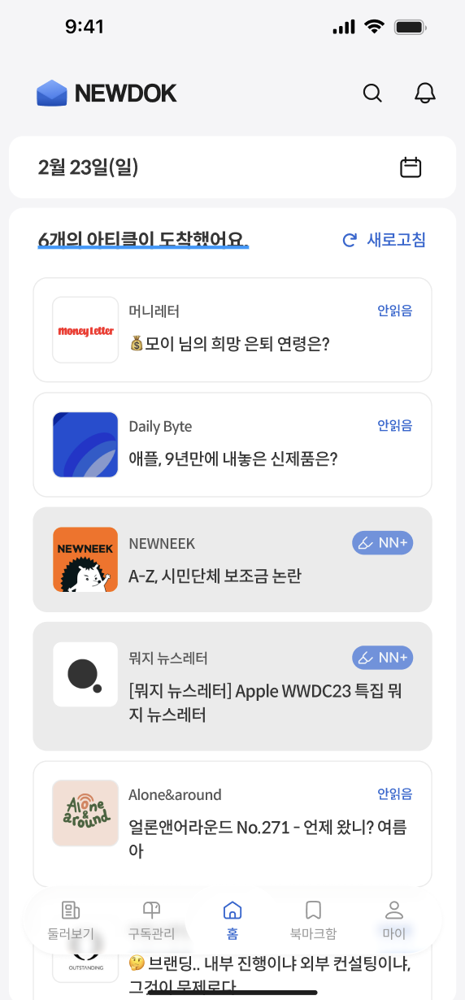
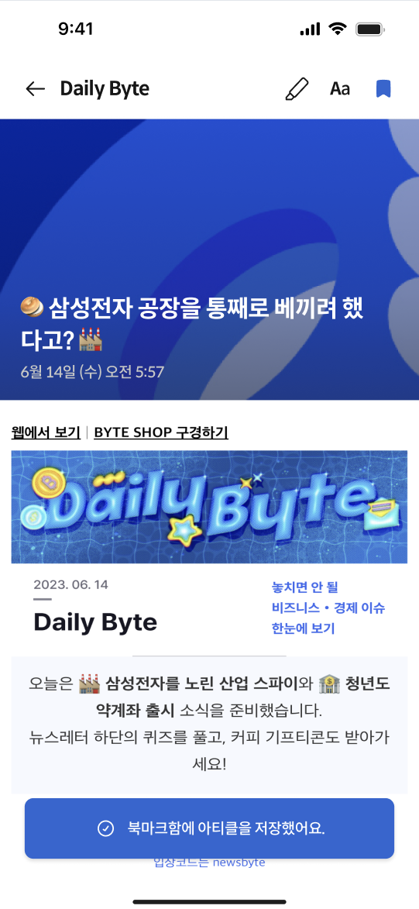
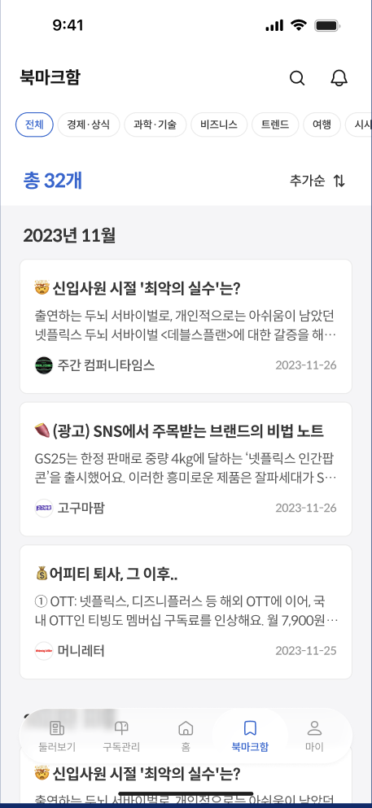
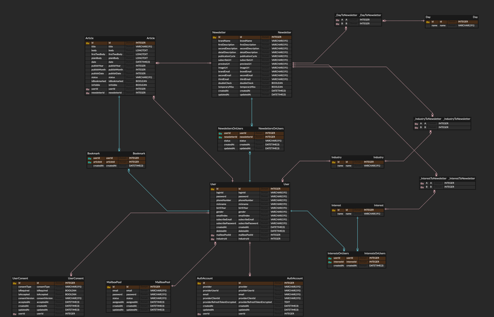

<div align="center">


## ✨ 2539 직장인을 위한 뉴스레터 큐레이팅 서비스, Newdok!

<br />



[](https://apps.apple.com/kr/app/id6749274214)

</div>


## 💡 Description

뉴스레터가 너무 많아서 어떤 걸 구독해야 할지 고민이신가요?

마음에 드는 뉴스레터를 찾기 어려웠다면 이제 뉴독이 여러분을 도와드립니다!

뉴독은 세 가지 불편함에서 시작했습니다.

1. 다양한 뉴스레터 브랜드가 있지만 직접 찾아 구독을 신청하기 어렵다
2. 구독을 신청해도 내가 어떤 뉴스레터를 구독 중인지 모른다
3. 개인 이메일로 구독하면 뉴스레터가 다른 메일과 섞여 읽기 힘들다

그래서 뉴독은 사용자에게 뉴스레터 구독 전용 이메일을 발급하고 그 메일함에 도착한
뉴스레터를 수집해 앱에서 모아 볼 수 있게 합니다. 클릭 한 번으로 구독 신청 및
관리까지 가능한 올인원 뉴스레터 큐레이션 서비스입니다.

이 저장소는 Newdok 서비스의 백엔드 API입니다.

<br />


## 👀 서비스 핵심 기능 소개

### 온보딩

첫 실행 시 맞춤형 서비스 제공을 위해 사용자의 취향을 파악합니다. <br/>

### 추천 뉴스레터

사용자가 고른 산업군과 관심사를 바탕으로 추천 뉴스레터 리스트를 제공합니다. <br/>

### 개인 아티클 수신함

구독신청한 뉴스레터로부터 수신받은 아티클을 날짜별로 관리하는 개인 우편함을 제공합니다. <br/>

### 북마크함

중요한 아티클을 북마크하여 언제든지 모아서 다시 볼 수 있는 북마크 관리 기능을 제공합니다. <br/>

### 구독 관리

원클릭으로 뉴스레터 구독 신청 및 중지, 재개가 가능한 구독 관리 기능을 제공합니다. <br/>

### 뉴스레터 검색

원하는 뉴스레터와 아티클을 키워드로 바로 찾을 수 있는 검색 기능을 제공합니다. <br/>

### 소셜 로그인

카카오, 애플 계정으로 간편하게 가입하고 시작할 수 있습니다. <br/>

<br />

| 온보딩 추천 | 홈 (오늘의 아티클) | 아티클 뷰어 + 북마크 | 북마크함 |
| --- | --- | --- | --- |
|  |  |  |  |
| 산업군/관심사 기반 맞춤 추천 API | POP3로 수집된 아티클 피드 | 수신 메일 본문 렌더링과 북마크 저장 | 북마크 조회, 카테고리 필터와 정렬 |

<br />


## 🧑‍💻 My Role

기획, 디자인, 앱(iOS/AOS), 백엔드로 구성된 팀 프로젝트에서 **백엔드를 전담**하고
있습니다 (2023.06 ~ 현재).

- 초기 설계부터 개발, 배포, 운영까지 백엔드 전 단계 담당
- 데이터베이스 ERD 설계와 REST API 개발
- POP3 프로토콜과 Cron Job 기반 뉴스레터 수집 파이프라인 구축
- Kakao / Apple OIDC 소셜 로그인 설계와 구현
- EC2, Docker/ECS, Lightsail/PM2로 이어지는 배포 인프라 구성과 운영 (아래 Deployment Journey)
- 베타 출시 후 지속적인 기능 QA와 Jest 테스트 코드 점진 도입

<br />


## 📐 Server Architecture

<!-- 아키텍처 다이어그램 제작 후 이미지 1장으로 교체 예정 -->

```text
iOS / AOS App
  -> Nginx (HTTPS, Let's Encrypt)
  -> NestJS API + PM2 (AWS Lightsail)
       +-- MySQL (Railway)
       +-- Mail server (POP3S)
       +-- Kakao / Apple OIDC JWKS
       +-- Twilio SMS

GitHub Actions --(SSH deploy)--> AWS Lightsail
```

상세 문서:

- [Project Summary](docs/project-summary.md)
- [Architecture](docs/architecture.md)
- [Social Login](docs/auth-social-login.md)
- [Mailbox And POP3](docs/mailbox-pop3.md)
- [Operations](docs/operations.md)

<br />


## ⚒️ ERD



필드 상세는 [prisma/schema.prisma](prisma/schema.prisma)를 참고합니다.

### Core Domains

- `User`: 뉴독 사용자 정보와 구독 이메일 계정 연결을 관리합니다.
- `AuthAccount`: Kakao, Apple 등 소셜 provider의 계정 식별 정보를 저장합니다.
- `UserConsent`: 회원가입 시점의 약관 동의 이력을 저장합니다.
- `MailboxPool`: 사용자에게 할당 가능한 구독 이메일 계정 풀을 관리합니다.
- `Newsletter`: 뉴스레터 브랜드 정보와 산업군/관심사/요일 필터 정보를 관리합니다.
- `Article`: POP3로 수신한 뉴스레터 아티클을 저장합니다.
- `Subscription(NewslettersOnUsers)`: 사용자와 뉴스레터의 구독 관계를 관리합니다.
- `Bookmark`: 사용자의 아티클 북마크를 관리합니다.

<br />


## 🛠️ Tech Stack

| Area | Stack |
| --- | --- |
| Runtime | Node.js |
| Framework | NestJS, TypeScript |
| ORM | Prisma |
| Database | MySQL (Railway) |
| Auth | JWT, Kakao OIDC, Apple OIDC |
| Mail Sync | POP3, mailparser |
| Deploy | AWS Lightsail, Nginx, PM2, GitHub Actions |
| API Docs | Swagger |
| Validation | class-validator, class-transformer |
| Test | Jest |

<br />


## 🚀 Deployment Journey

배포 인프라는 서비스 단계에 맞춰 세 번 바뀌었습니다.

```text
1) AWS EC2 수동 배포 (2023 베타)
   -> 초기 출시. 서버에 직접 접속해 빌드/재시작하는 방식의 운영 부담 확인

2) Docker + AWS ECS 컨테이너 배포 전환
   -> 컨테이너 오케스트레이션을 직접 구축해보기 위한 전환.
      쿠버네티스 대비 접근성이 좋은 ECS를 선택해 Dockerfile 작성,
      태스크 정의, GitHub Actions 빌드/배포 파이프라인까지 구성.
      구축 후에는 배포와 롤백 관리가 간편해짐

3) AWS Lightsail + Nginx + PM2 (현재)
   -> 서비스 재활성 시점에 현재 규모와 운영 비용을 다시 판단.
      소규모 트래픽에서 ECS 유지 비용과 관리 오버헤드 대비 실익이
      낮아 Lightsail + PM2 구성으로 재조정. Nginx와 Let's Encrypt로
      HTTPS를 구성하고 GitHub Actions SSH 배포로 자동화 유지
```

각 단계의 구성은 git 히스토리에 남아 있습니다 (Dockerfile, 배포 워크플로 커밋).

<br />


## 🗂️ Project Structure

```text
src/
├── auth/         # SMS 인증, 소셜 로그인(Kakao/Apple OIDC), 소셜 회원가입
├── users/        # 사용자 정보 조회/수정, 탈퇴
├── newsletters/  # 뉴스레터 목록, 구독 신청/중지/재개
├── articles/     # 아티클 조회, 북마크, POP3 수집 실행
├── search/       # 뉴스레터/아티클 검색
├── options/      # 산업군, 관심사, 요일 옵션 조회
├── scheduler/    # Cron 기반 POP3 자동 실행
├── guards/       # 인증 가드
└── common/       # 공통 유틸
prisma/           # 스키마, 마이그레이션
scripts/          # 뉴스레터 CSV import 등 운영 스크립트
public/           # 뉴스레터 브랜드 이미지 (정적 서빙: /public)
docs/             # 아키텍처/운영 상세 문서
```

<br />


## 🔐 Authentication Flow

### Social Login

현재 앱 우선 연동 기준으로 Kakao와 Apple 로그인을 지원합니다.

```http
POST /auth/social-login
```

```json
{
  "provider": "KAKAO",
  "platform": "IOS",
  "idToken": "provider-id-token"
}
```

백엔드는 provider별 공개키(JWKS)로 `idToken`을 검증하고, 검증된
`provider + providerUserId` 조합으로 내부 계정을 조회합니다.

- 기존 가입자: Newdok JWT와 사용자 정보를 반환합니다.
- 신규 가입자: 회원가입용 `signupToken`을 반환합니다.

```http
POST /auth/social-login/signup
```

신규 가입자는 `signupToken`, 닉네임, 출생연도, 성별, 약관 동의 정보를 전달해
회원가입을 완료합니다.

### Local Auth

기존 이메일/비밀번호 기반 회원가입, 로그인, SMS 인증 API는 소셜 로그인 완전
전환 전까지 임시 유지합니다.

<br />


## 📬 Mailbox And POP3 Flow

Newdok은 사용자에게 뉴스레터 구독 전용 이메일 계정을 할당합니다. 사용자는 이
이메일로 뉴스레터를 구독하고, 서버는 POP3로 메일을 주기적으로 조회해 Article로
저장합니다.

```text
User signup
-> assign MailboxPool email
-> user subscribes to newsletters
-> POP3 scheduler fetches received emails
-> match newsletter sender
-> save Article
-> update subscription state if needed
```

MailboxPool 정책:

- `AVAILABLE`: 한 번도 할당되지 않은 이메일만 사용합니다.
- `ASSIGNED`: 현재 사용자에게 연결된 이메일입니다.
- `RETIRED`: 과거에 사용되어 재할당하면 안 되는 이메일입니다.

한 번 사용자에게 할당된 구독 이메일은 탈퇴 후에도 재사용하지 않습니다.

<br />


## 📰 Newsletter Data Operations

뉴스레터 브랜드 데이터는 운영자가 Notion에서 관리하고, CSV export를 통해
스크립트로 dev/prod DB에 반영합니다.

기본 절차:

```text
1. Notion에서 신규 뉴스레터 CSV export
2. dev DB에서 dry-run
3. dev DB에 apply
4. dev 앱에서 노출/필터/이미지 확인
5. 필요한 필드 보정
6. prod DB에 같은 CSV apply
7. prod 앱 확인
```

CSV export 파일은 운영 데이터이므로 커밋하지 않습니다.

<br />


## ⚡ Getting Started

### Prerequisites

- Node.js
- npm
- MySQL database
- PM2, 배포 서버에서 필요

### Install

```bash
npm install
```

### Environment Variables

환경별 env 파일은 로컬에서만 관리합니다.

- `.development.env`
- `.production.env`

비밀값 없는 예시는 [.env.example](.env.example)을 참고합니다.

주요 환경변수:

```text
PORT
DATABASE_URL
JWT_SECRET_KEY

KAKAO_REST_API_KEY
KAKAO_OIDC_AUDIENCE

APPLE_CLIENT_ID
APPLE_WEB_CLIENT_ID

TWILIO_ACCOUNT_SID
TWILIO_AUTH_TOKEN
TWILIO_MESSAGING_SERVICE_SID
```

`.env`, Apple `.p8` key, 운영 CSV 파일은 커밋하지 않습니다.

### Prisma

```bash
npx prisma generate
npm run db-push:dev
```

prod DB 변경은 dev에서 검증한 뒤 실행합니다.

<br />


## 📜 Scripts

| Command | Description |
| --- | --- |
| `npm run start` | 개발 서버 실행, `start:dev` alias |
| `npm run start:dev` | 개발 서버 watch 모드 실행 |
| `npm run start:prod` | 빌드 산출물 production 모드 실행 |
| `npm run build` | NestJS 빌드 |
| `npm run deploy:dev` | PM2로 dev 프로세스 시작 또는 재시작 |
| `npm run deploy:prod` | PM2로 prod 프로세스 시작 또는 재시작 |
| `npm run db-push:dev` | dev DB 스키마 반영 |
| `npm run db-push:prod` | prod DB 스키마 반영 |
| `npm run db-pull:dev` | dev DB 스키마를 Prisma schema로 introspect |
| `npm run db-pull:prod` | prod DB 스키마를 Prisma schema로 introspect |
| `npm run db-studio:dev` | dev Prisma Studio 실행 |
| `npm run db-studio:prod` | prod Prisma Studio 실행 |
| `npm run import:newsletters:dev` | dev 뉴스레터 CSV import |
| `npm run import:newsletters:prod` | prod 뉴스레터 CSV import |

<br />


## ✅ Verification

```bash
npm run build
```

Auth 변경 시 관련 테스트를 실행합니다.

```bash
npx jest src/auth/auth.controller.spec.ts src/auth/apple-auth.service.spec.ts --runInBand
```

Swagger 문서는 서버 실행 후 `/api`에서 확인합니다.

<br />


## 📝 Operational Notes

- dev에서 먼저 검증하고 prod에 반영합니다.
- DB 스키마 변경이 없으면 `db push`를 실행하지 않습니다.
- prod DB 변경, 데이터 삭제, 대량 import는 사전 검증 후 진행합니다.
- 소셜 로그인에서 이메일은 고유 식별자로 사용하지 않습니다.
- 소셜 계정은 `provider + providerUserId` 기준으로 식별합니다.
- POP3 스케줄러는 삭제된 사용자(`deletedAt` 존재)를 수집 대상에서 제외해야 합니다.
- Swagger response 예시는 앱 연동 기준으로 유지합니다.
